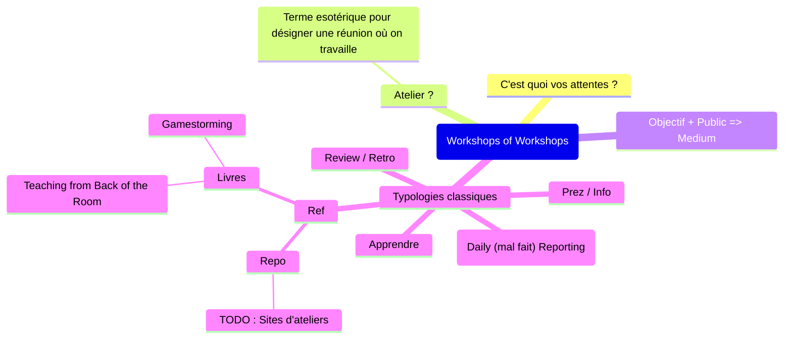

---
tags:
  - mdm
---
# Tasks

~~~tabs
tab: By Priority
```dataview
TASK  
FROM "Work/Missions/MdM/Logs"   
    OR "Work/Missions/MdM"   
    OR #mdm   
    OR #mdm/project AND -#⏸️pause  
WHERE !completed  
GROUP BY choice(contains(text, "🔺"), "🔺 Highest",   
    choice(contains(text, "⏫"), "⏫ High",    
    choice(contains(text, "🔼"), "🔼 Medium",   
    choice(contains(text, "🔽"), "🔽 Low",   
    choice(contains(text, "⏬"), "⏬ Lowest", "🟰 None"))))) as priority  
SORT tags DESC
SORT choice(priority = "🔺 Highest", "1",     
    choice(priority = "⏫ High", "2",     
    choice(priority = "🔼 Medium", "3",     
    choice(priority = "🔽 Low", "5",    
    choice(priority = "⏬ Lowest", "6", "4"))))) ASC
```

tab: By Tag
```dataview
TASK 
FROM "Work/Missions/MdM/Logs"   
    OR "Work/Missions/MdM"   
    OR #mdm   
    OR #mdm/project AND -#⏸️pause
WHERE !completed
GROUP BY tags
SORT tags DESC
```

tab: By File
```dataview
TASK 
FROM "Work/Missions/MdM/Logs"   
    OR "Work/Missions/MdM"   
    OR #mdm   
    OR #mdm/project AND -#⏸️pause
WHERE !completed
GROUP BY file.name
SORT file.name DESC
```


~~~

# Logs

## [[2024-07-19]]

- [ ] Plan de formation sur les tests-auto pour les équipes 🔺 

Idée à la con : suivre le nombre d'US modifées après coup
> C'est un peu décevant le nombre d'US qui sont modifiées après coup...   
> Ca devrait être un KPI à suivre 😜


## [[2024-07-09]]
- [x] [[Escape Game Supply]] / Bingo 🔺 ✅ 2024-07-19
- [ ] #mdm/supply/acot PoC-er Mermaid JS pour 
	- [[Matrice des connaissances]]
	- [[📊 Software Cockpit]].
- Tests auto
	- Scheduled pipeline
	- Un seul test plan pour les gouverner tous
	- Remarques : sur QC-1 (exécuté par QC-5 et par QC-1336), on a deux "Story testée"
	  => On télécharge et on exécute deux fois les tests
- [[Evaluer l'impact des ateliers]]

[[Taverne des créatifs]]
## [[2024-07-01]]

- Point de partage dev
- [x] Passer en revue mes priorités 🔺 ✅ 2024-07-10
## [[2024-06-18]]

- [ ] #mdm/supply/acot A ajouter dans notre legacy "projet avec un DockerFile" + la raison


Call avec Adrien
- respose sur moi

## [[2024-05-27]]

- Controller/Service/Persistance
	- Tracer la pratique "repsonsabilité de chaque couche"
	- Mapping de surface dans la couche controller
	- ![[Pasted image 20240527141409.png]]


## [[2024-05-15]]

- [ ] DDD pour Christelle
- [ ] Explorer Gitpage pour supply overview 🔼 

## [[2024-04-24]]

A ajouter à la matrice des connaissances TRP

- Communauté QA
- Autonomisation du MET HOME PICKUP
- ACO
- 3Amigos
- SCRUM => A détailler ?
- Processus de test

### Seconde chance

* Métier intéressés par la démo => n/a
	* Se greffer dans le point de démo TRP => oui
* Daily / synchro
	* => on va s'organiser en task force 9h?, pierre facultatif
	* Bien séparer les daily
	* => faire un truc async
* Board dédié dans Jira
	* tout ce qui est raccroché au TRP-5634
	* Priorisation
* MEP et organisation
	* pas d'autres sujets
		* => si : l'api des délais
	* fil de l'eau
	* feature flag = essayer
* Merge request
	* Notifié des MR
		* dans le canal TRP/Dev
	* Approve : la task force autonome
	* Code review d'équipe
* Techno / Conception
	* Pas de préco
	* [[Circuit Breaker]] à bien respecter
	* Rediscuter de la gestion des services
		* MDD à faire évoluer
		* passage du contexte en header  => à discuter besoin
	* Attention à Bertrand : pas forcément en phase avec les prio du sujet et le lag sur les contrats 
	* Digit en relecture du contrat du MET => Denis, Florian Guilleret

## [[2024-04-22]]

* [[Matrice des connaissances]] pour TRP
* [[CB - 2024-04-22]]
* [[2024-04-22 - STK - Atelier sur le process de versionning]]
## [[2024-04-18]]

Seconde chance
* Comment faire en sorte que sku neuf et 2ndC ont la même dated e dispo stock ?

TILS : Refinment ? Partage de connaissance vs. Mise en oeuvre d'un plan d'action pour réalisation

* Groupe de travail
	* Ordre du jour prochaine session
		* PBT
		* Repository
		* Sid Ali
		* Clean Code
	* SONAR
		* Faire un lien "fiche projet"
		* Sondage
* Partage dev
	* Jackson && dates
	* Maven && BOM (effective pom => moiseà jourdu bom)

## [[2024-04-15]]

* Seconde chance
	* SKT
		* api disponibilité de produits
		* batch de la descente des commandes clients vers ACE
		* -> prévu fin juin
		* Risque : consultaiton de stock ok
	* TRP
		* MET
		* => Fabien LT sur le sujet
[[CB - 2024-04-15]]

- [ ] #mdm/supply/partage-dev Synthétiser la discussion "Quand versionner un composant ?"
- [ ] #mdm/supply/dev Ajouter la pratique "Version dès qu'on pushe sur master"
- [ ] #mdm/supply/dev Ajouter la pratique "Version ReleaseCanditate dès qu'on pushe sur master et version quand on prépare une MEP"

## [[2024-04-11]]

- [ ] #mdm/grp-qualité CleanCode : Organiser un point pour discuter du contenu
- [ ] #mdm/grp-qualité Organiser la capitalisation de la connaissance
## [[2024-04-10]]

- [x] #veille Creuser les concepts de "[[Howto work with me]] [[Personal README ou Personal User Manual]]
	* Bragging Doc

## [[2024-04-09]]

* **Shodo x MdM**
	* tour de table
		* CB : ancienne test lead
	* pas mal de changement a venir sur la Supply
		* Changement de culture et de process projet
		* Process qualité
		  => Equipes bousculées
		  Qualité : pas uniquement tester
		* Limiter le turnover
			* Developper experience
		* Identifier les freins : / QA / PO métier
			* Ré-fractaires au changement
	* 3 mois
		* mise en place d'indicateurs
			* Vie de l'équipe
			* PO / LD : mettre en place des indicateur de communication auprès des équipes
			* Satisfaction des utilisateurs et des collaborateurs
	* Profils qui partent : remplacer ces personnes
	  => Recherche des personnes moteur, accepter et accompagner el changement
		* Mandat particulier ?
			* Oui : Lead Dev
			* D'abord regarder en interne pour qqn de moteur au changement
			* Et un développeur·euse en plus pour le 14 juin (fin mai)
			  => Budget ?
	  => Remettre les compétences là où elles doivent être
		* Remettre Fabien pour accompagner les développeurs
			* Produire des KPI
			* Mais avoir une partie de dev encore
			  => cohérence par rapport au niveau d'intervention
		* Règles Maisons du Monde pour le 3+ans ?

## [[2024-04-08]]

* Point de partage dev
	* Design Pattern : Repository
* Sprint panning
* [[CB - 2024-04-08 - Etat des lieux activité]]
- [x] #shodo Question A Joly et idées d'articles
	* Lead Dev et 1to1 ? C'est quoi le rôle d'un Lead Dev dans le management ?
	* Lead Dev Management externe / externe vs. suivi de missions
	* Harcèlement
	* Quelle est la différence entre un Lead Dev, un [[Staff Engineer]] et un [[Engineering Manager]] ?
	* Comment mettre en place un rituel de partagez tech ?
## [[2024-04-05]]

- [x] Préparer le point de Lundi avec [[Christelle BARADÉ]] ✅ 2024-04-05
	* Etat des lieux de mon activité
	* Suggestions / remarques sur les actions possibles à court terme
	* [[CB - 2024-04-08 - Etat des lieux activité]]
- [x] #perso Capitaliser sur "Comment organiser un point d'équipe tech" ✅ 2024-07-05
      [[RC - 2024-04-05 - Comment organiser un point d'équipe tech]]
## [[2024-04-04]]

> La pyramide : le poids il est en bas
> -- Benoît GIUSEPPIN

KT : Knowledge transfert
## [[2024-04-02]]

- [x] Cache à mettre sur api-cata-log
- [x] pool de connexion hikari à augmenter
	* Penser à le faire également sur la DLQ
- [x] Allouer davantage de ressources aux pods (size S, M, L,XL)
- [x] Définir une XX:MaxRAMPercentage : par défaut elle est à 25%

=> Le rejeu des messages pose problème => on l'a désactivé
## [[2024-03-28]]

- [x] #decathlon Julien : s'assurer de savoir ce qu'on met derrière l'accompagnement DDD Tactique
    * Préparer ce que moi je mets derrière l'intervention
- [x] #decathlon Anthony : prévoir un call pour cadrer l'intervention
    * lieu + date
    * intervention
    * 1/2 journée d'acculturation ?

**flow order [flow-warehouse-order-customer-to-shipup]**
- [x] Clarifier le healthcheck pour els api
- [x] Regarder pour voir s'il y a quelque chose à faire en terme de perfs ✅ 2024-04-02
	* cf [[#2024-04-02]]

**flow order [flow-warehouse-order-customer-to-shipup]**
- [x] Commandes legacy => pas de sale channel => on les filtres ✅ 2024-03-28
	- [x] absence du sale channel à logger dans la DLQ ✅ 2024-03-28
- [x] DELIVERY_NOTE_ALREADY_KNOWN ✅ 2024-03-28
	* Evincer les messages cancel
- [x] Corriger les libellés des produits ✅ 2024-03-28
	* Nécessite de finir de dev de la locale ussuer (languie + country)
	* nécessite de combiner les devs (éventuellement de faire une code review tous ensemble pour merger sur master)

**flow expé [flow-delivery-shipment-to-shipup]**
=> Sur un temps plus long
- [ ] #mdm/supply/traça/flow-expé Lister les TODO / amélioration vues par STK sur le flow
- [ ] #mdm/supply/traça/flow-expé Documenter le flow a minima (README, schéma)
- [ ] #mdm/supply/traça/flow-expé Prévoir une Revue de Code en équipe (stk + trp) pour
	* présenter la liste des améliorations
	* s'organiser pour "qui fait quoi" sur le flow expé

## [[2024-03-10]]

Gestion des TODOs
- [x] Message MdM ✅ 2024-03-13
	- [x] ShipUp ✅ 2024-03-13
	- [x] Stock ✅ 2024-03-13
	- [x] GRP Qualité de code ✅ 2024-03-13
- [x] Reprendre le DDD par Julien ✅ 2024-04-18
- [x] Réviser l'EventStorming ✅ 2024-04-18
- [x] Veille ✅ 2024-04-18

## [[2024-03-06]]
**🚨 Problème des Code barres**
Voir dans les tables ETI2 ETI3

Questions à adresser à DISTI sur le sujet :
* Duplication de ligne Code-barre / produit ? sur eti2client & eti3client

## [[2024-03-04]]

## [[2024-02-12]]

- [ ] #mdm/grp-qualité PI : Coding Dojo "Refactoring"
- [x] #mdm/grp-qualité PI : Season Review + Season Retrospective

## [[2024-02-07]]

CODEV
* plouf plouf https://plouf-plouf.fr/
* Hackathon
	* S'assurer que tout le monde ait un niveau minimum pour adresser les sujets
	* LocalAI : LLM en local
	* ChatBot UI

## [[2024-02-06]]

* Découverte de [[JetBrains Toolbox]]
## [[2024-02-07]]

- [ ] #mdm/supply/dev Clarifier les états A évaluer // A essayer des pratiques
- [ ] #mdm/supply/dev Qui à les droits sur quoi ? Recenser les envs de prod et ce qui manque pour que les équipes soient autonomes en cas de changement

## [[2024-01-31]]

- [x] #mdm/supply/stk Brancher New relis sur api-stock availability
- [x] Mail à envoyer à Shipup, mais sur quel sujet ? ✅ 2024-02-01
- [x] Brancher un troisième Integration flow pour le process de récupération des infos des jobs ✅ 2024-02-01
## [[2024-01-24]]

Daily TRP : Organisation de la journée ? ou reporting ?
* "Et après, je en sais pas sur quoi je pars" => Est-ce que c'est normal d'entendre ce genre de phrase au Daily ? Et, est-ce que c'est normal de laisser cette question dans réponse ?

**Traçabilité**
* Récupération des libellés des produits dans toutes les langues => api-xxx-catalog
* Il faudra mettre les libellés dans un cache des flow
* Vu que ça bouge tellement peu, il le cache pourrait être persisté dans une BDD propre aux flow

**Idées de discussion Atelier Tech**
* Clarifier / Ecrire le but de l'"Atelier Tech DSI"
	* Partage opérationnel vs. partage exploratoire ?
* Semaine de PI : est-ce que la Tech de la DSI veut s'emparer d'un atelier à faire tous ensemble ? (World Coffee, Coding Dojo, Atelier sur un sujet particulier)
* Confluence & Documentation
	* RACI et devenir des différents "espace Tech" ? (Core, SRE, Infra, PFTech)
	* Fiche des outils (SONAR GitLab) et leurs RACI
* Veille
	* Newsletter Tech MdM ?
	* Canaux de partage ? Routines de partage ?

Idées Perso
- [ ] #perso Publier le catalogue des ateliers sur mon blog ⏫ 
## [[2024-01-22]]

Agacé par PG sur Traçabilité "Ah ben non, on n'a rien à te donner"

> Hello Florian, tu vas bien ?
> Message pas urgent : Je voulais te remonter une anecdote qui vient de m'arriver sur la réalisation du projet Traçabilité/ShipUp.
>
> Ca fait un Sprint (2 semaines depuis mon retour de congés) qu'on me tient le discours "Ca va être chaud la réal sur Traçabilité (côté TRP)
> Donc, je m'organiser pour participer activement aux développements comment on avait acté à notre réunion "stratégie de réalisation ShipUp vs Horizon" (https://teams.microsoft.com/l/message/19:meeting_ZmJkMjcxMDUtMzZjNS00ODM3LThiMDItNzgzODllOWQ1OTA0@thread.v2/1703092831258?context=%7B%22contextType%22%3A%22chat%22%7D). En mettant de côté des sujets comme le cadrage de la monté de version ERP.
>
> Ce matin, au moment d'organiser les travaux TRP pour le Sprint à venir, on me dit "Ah ben non en fait, on va s'en sortir correctement sans toi".
> => C'est positif car TRP arrivera à avancer sur ShipUp
> => Pas de conséquence pour moi, car Stéphane et STK sont très content de disposer de mon temps prévu sur Traçabilité/ShipUp (notemment sur les sujets TRP qu'ils traitent)
>
> En revanche, je suis agacé de l'effort que l'on met pour rassurer Pierre, et pour organiser notre travail en fonction de ses craintes et des alertes qu'il remonte, pour finalement constater que ces efforts ne servent à rien.
>
> Voilà :)
> Bonne fin de journée.

ACOT
* Prévoir de relancer une analyse SONAR sur les différents projets

## [[2024-01-19]]

Parc technique sur Confluence
Codeowners
GRP
* Communication
* Réviser Gilded Rose

## [[2024-01-18]]

**Atelier Tech DSI**
Desiderata Atelier tech
* Atelier full DSI : DIGIT, INFRA, CORE, SRE, RSSI (public très large)
* Bouillon de culture

Co-Construire l'ordre du jour + vote
Rajouter du fun
S'appuyer sur des Mini groupes de travail / Communauté pour alimenter le Backlog et les sujets de la Communauté.

Il faut un côté Exploratoire à cet Atelier
=> le ROI est pas forcément palpable, mais il a du sens

"Ce qu'il faut faire / Pas faire" : normes et standards

Si je veux troller, je pourrais rajouter des trucs : 
Exemple : Qu'est ce qui manque au CODEV pour en faire une communauté ?
 - Une newsletter de veille techno
 - Une homogénéisation de l'espace tech Confluence (et un RACI de l'espace commun)
 - Un RACI documenté de nos outils du quotidien (GitLab, Sonar)

## [[2024-01-16]]

- [ ] #mdm/supply/dev Bonnes pratiques de MEP

* [[MxC - 2024-01-16]]
- [ ] #mdm/supply/acot Etablir les critères de priorité du Legacy 
	* * poids des critères
	* * valeurs des critères
	* quantifier les irritants / le temps passé / le risque / le gain
	* quantifier la dette technique / fonctionnelle
	* quantifier la maintenabilité / la connaissance de l'équipe
- [ ] #mdm/supply/acot Remettre le Backlog ACOT à plat

**Parc Applicatif**

**Repository de configuration**
* https://git.maisonsdumonde.net/core/dev/scm/warehouse-stock/deployment-config/-/tree/master/prod?ref_type=heads
* Référence la configuration pour les projets suivants
	* https://git.maisonsdumonde.net/core/dev/scm/warehouse-stock/api-warehouse-stock-level/-/blob/master/deploy/conf/prod/deploy.yml?ref_type=heads
	* https://git.maisonsdumonde.net/core/dev/scm/warehouse-stock/api-warehouse-stock-availability/-/blob/master/deploy/conf/prod/deploy.yml?ref_type=heads
	* https://git.maisonsdumonde.net/core/dev/scm/warehouse-stock/api-stock-external-supplier/-/blob/master/deploy/conf/prod/deploy.yml?ref_type=heads
	* https://git.maisonsdumonde.net/core/dev/scm/warehouse-stock/api-prereservation/-/blob/master/deploy/conf/prod/deploy.yml?ref_type=heads
	=> ✅ On peut dégager le repo de configs
	 - [x] Archiver le repository Gitlab `core/dev/scm/warehouse-stock/deployment-config` ✅ 2024-02-01
* https://git.maisonsdumonde.net/core/dev/scm/carrier/referentiel-configuration/-/tree/master/prod?ref_type=heads
	* Référence la configuration pour les projets suivants :
		* https://git.maisonsdumonde.net/core/dev/scm/carrier/api-services-catalog
		* https://git.maisonsdumonde.net/core/dev/scm/carrier/api-carrier-repository
	Qui sont sur des version de pipeline en v1.x.x, avec des applications dans les sf "api-xx"
	=> On **ne peut pas** encore dégager les repos
	- [ ] #mdm/supply/acot Archiver le repository Gitlab `core/dev/scm/carrier/referentiel-configuration`
		- [ ] #mdm/supply/acot Décomissionner le vieux deployment de `core/dev/scm/carrier/api-services-catalog`
		- [ ] #mdm/supply/acot Décomissionner le vieux deployment de `core/dev/scm/carrier/api-carrier-repository`
* https://git.maisonsdumonde.net/core/dev/scm/export/referentiel-configuration/-/blob/master/prod/api-export-shipments-management.deployment.yml?ref_type=heads
	Référence un seul projet qui n'xiste plus
	=> On peut dégager le repository de configuration
	- [x] Archiver le repository Gitlab `core/dev/scm/export/referentiel-configuration` ✅ 2024-02-01

**Documentation**
* https://git.maisonsdumonde.net/core/dev/scm/warehouse-stock/docs
	* Documentation sur le MET, LEO et les Stocks unifiés mise à jour 12, Oct 2021
	  => Je, pense qu'on peut dégager
	  => A déplacer dans la fiche de cadrage LEO, au moins dans une partie MET, fiche de cadrage
* https://git.maisonsdumonde.net/core/dev/scm/export/documentation
	  - Documentation sur un "front-search-and-consult-customer-order" qui ne semble exister nulle part (question à Nicolas GAYE)
	  => Je pense qu'on peut dégager
* https://git.maisonsdumonde.net/core/dev/scm/customer-delivery/documentation-et-modes-op-ratoires
	* Documentation TRP à déplacer par TRP
* https://git.maisonsdumonde.net/core/dev/scm/carrier/postman-mct-test
	* Documentation TRP pour le MCT avec une collection Postman

**Autres**
* https://git.maisonsdumonde.net/core/dev/scm/warehouse-stock/gitlab-templates
	* Template de MR nommé "DoD"
	   => A déplacer au niveau "SCM" ?
	   => A dégager , mais il se peut qu'"ok
	- [x] Archiver le repository Gitlab `core/dev/scm/warehouse-stock/gitlab-templates` ✅ 2024-02-01
		- [x] Créer l'équivalent au niveau de supply ✅ 2024-02-01
* https://git.maisonsdumonde.net/core/dev/scm/customer-delivery/poc-tracking-tool
	* POC de l’outil de tracking (Ship Up & Welcome Track)
	  => Quelle durée de vie de ce repo ?
	  => Repository encore nécessaire, au mieux à mettre en read-only

## [[2024-01-15]]

Supply
- [ ] #mdm/supply Mettre en place des CODEOWNERS Sur tous les projets⏫ 
- [x] Modifier le format du Catalogue de pratiques SUPPLY ✅ 2024-01-16
- [ ] #mdm/supply/acot Mettre à plat les actions sur le parc applicatif, issue du Software Cockpit du parc applicatif SUPPLY
- [x] #mdm/grp-qualité Préparer la communication de la prochaine instance

## [[2024-01-12]]

Idée de troll à Bertrand
> C'est vendredi, j'ai envie de troller.
> Dans quelle mesure je rajoute à l'ordre du jour "Atelier tech DSI" tout ce qui manque au CODEV pour en faire une communauté ?
> * Une newsletter de veille techno
> * Une homogénéisation de l'espace tech Confluence (et un RACI de l'espace commun)
> * Un RACI de nos outils du quotidien (GitLab, Sonar)
## [[2024-01-10]]

**Cockpit**
* Idée : snapshot à chaque PI les version des composants mis en REC/PROD et comparer la diff avec les précédent, pour voir ce qui a changé
=> HYPER IMPORTANT
* CODEOWNERS à mettre en place
  Exemple : https://git.maisonsdumonde.net/core/dev/pro/assortment/api-export-dispatch-assortiment-magasin/-/blob/master/CODEOWNERS
- [x] Faire une passe avec Bertrand des trucs identifiées comme à mettre au niveau "SCM" + Docs
	ex: **warehouse-stock/gitlab-templates**

## [[2024-01-08]]
* Retour de congés
### **Organisation**
#### **Supply**
* Supply : ACOT
	* Cockpit => préparer pour le prochain point de partage
	* ✅ Planifier des réunion pour passer en revue les composants et noter le score de maintenance
		* ✅ STK
		* ✅ TRP
	* ☑️ [[Tidying]] : cadrer le sujet avec Maxime [[Tidy First]]
		* ✅ Maxime convaincu
		* Cadrer la pratique
			* ✅ Créer les EPICS
			* ✅ Créer la page
			* Lister les mouvements + templates de message de commit Git
				* Donner des exemple de quelques mouvement à ne pas faire (ex: mise à jour de dépendances)
			* ✅ Cadrer le temps / fréquence / Actions à faire si ça prend trop de temps
			* Proposer un template / script de création, d'US
* Supply
	* Revue de PROD
	* ✅ Prévoir les 1-1 avec les gars
	* Confluence : finir de réorganiser la Doc
* Supply : Parc applicatif
	* Sujet Cockpit
	* Priorisation ACOT => [[Axes de priorisation du Legacy]]
	* Suivi des compétences de l'équipe pour entretenir le parc
* **⚠️ Pimp My ERP**
	* ✅ Lister les composants
	* ☑️Compléter les info avec les deux équipes TRP / STK
		* ODI
		* e107 & Zend
		* Java Legacy
		* Java Sprint Boot
	* Note : **Conclusion**
		Pour conserver la compatibilité avec la base de données ACE (Oracle 19.x) et CUPIDON (Oracle 11.2.0.4), les composants techniques doivent avoir à minima une **JDK 8** et le driver **ojdbc8.jar**.
	* => Peut-être utiliser le Cockpit
* Migration GKE
#### Groupe de travail : Qualité de Code
* Groupe de travail : Qualité de Code
	* Proposer une organisation du board
	* Préparer les sujets
		* Refactor et code coverage
		* Tidying / Tidy Code
## [[2023-12-19]]

**Supply**

> Bonjour Elodie,
>
> Merci pour l'animation de l'atelier de Lundi pour la Supply.
>
> Nous n'avons peut-être pas eu l'occasion d'aborder le sujet, mais nous avions commencé un travail avec Florian pour déterminer ce que lui, et nous attendions d'un RD. L'objectif était de tout mettre à plat afin de voir comment l'équipe pouvait s'organiser, et mettre en évidence les rôles et actions où nous avions besoin d'un manager.
>
> Le travail en cours est disponible ici :
>
> Malheureusement, faute de temps à nous accorder, Florian n'est pas présent avec nous pour nous permettre d'avancer. Et l'équipe (dont moi) ne prenons pas le temps de le relancer.
>
> Est-ce que reprendre cet atelier, ou le reprendre sur un autre format, pourrait être une piste pour permettre à la Supply de se relancer ?

**ACOT**
Questions à poser
* Comment identifier et prioriser les gros sujets ACOT ? EPIC / Initiatives / Idées
* Comment s'organiser autour du Tidying ?

**[[Workshops of Workshops]]**


## [[2023-12-18]]

**Point avec la méthodo**

> Supply pas forcément au clair avec les priorité du PI

**Actions pour le PI :**

- [x] Regarder la fiche des pratiques ✅ 2024-01-08
- [x] Présenter la pratique du [[Tidying]] ✅ 2024-01-08
- [x] Présenter le refactor ✅ 2024-01-08

## [[2023-12-13]]

**Discussion Revue de PROD avec Christelle**

- [x] S'assurer que la MEP du 04 décembre soit bien renseignée (activation flow reverseIO) ✅ 2024-02-01
	* Incident problématique car pas testé en amont
- [x] Proposer un encart pour mettre les incidents Teliae dans la revue de prod ✅ 2024-02-01

## [[2023-12-12]]

**Echange avec Constance**

* Retour sur le Comité
	* Quels sujets pour 2024 ?
	  => l'équipe semble avoir compris les objectifs, mais a peu de retours à faire.
* Déménagement : rapprocher tout le monde, mais flex office ?
	* Objectif : éviter le flex au maximum, mais il va falloir composer avec
	* Transitoire : idée tout de même de trouver un siège où mettre tout le monde
	  => Regrouper les équipes, c'est un moyen d'avoir une animation plus pertinente
* Responsable de domaine
	* Franck : ascenseur émotionnel, pas anticipé par [[Constance FOUQUET]]
	* Challengé sur les sujets XPL, autonomie métier, LEO, Business qui se tend
	* Volonté affichée de trouver quelqu'un
	* Prio des sujets :
	  _Horizon > Traçabilité > Seconde chance_
		* Question : "Pourquoi cette prio n'est pas anticipée ? / communiquée en amont ?"
		  => "2nde chance" est connu depuis très longtemps, mais ce sont deux autres sujets qui passent devant
		  => Constance aussi s'interroge : objectif depuis l'an dernier, est d'être la plus transparente possible.
		  * Où l'info se perd ? On a des chiffrages techniques qui ne correspondent pas à ce qu'on a embarquer. Sujet pas bien cadrés par métier / Chiffrage IT pas corrects.
		  * Pas choquant de voir les prios évoluer dans le temps (contexte légal qui change, contexte qui change) => Avantage de l'itération
		    _La seule constante, c'est le changement_
		 * Irritants identifiés, mais pas embrassés => ex: Traçabilité (pas de business identifié)
		 * Les équipes ne se sont pas emparées du sujet => La conception de la DSI de [[Constance FOUQUET]], c'est que la DSI est un moyen moteur et un facteur d'innovation
		 * => On a la capacité à proposer des choses : des solutions, des idées,
	* Se faire aider par [[Elodie PRODHOMME]] (Méthode) pour se faire aider à prioriser, s'organiser autour du PI, des projets et des sujets
	* Ne pas hésiter à en référer directement auprès de [[Constance FOUQUET]] en cas de questions
* Communauté de pratique : qu'est ce qu'on entend par là ? Qu'est ce qu'on veut en faire ?
	    => Quel est le contrat social qui lie les communautés de pratiques les collaborateurs (internes et externes) et Maisons du Monde ?
	    => La DSI, dispatchée entre les différents sites Nantes / Paris / Marseille semble compliquée à aligner. Quelle est l'organisation proposer/ attendue des Communautés au travers des sites ?
	* Constat : aujourd'hui, on n'a pas de comitologie sur les gens qui font le même métier, mais qui n'échangent pas.
	* Vision de Constance
		* Discuter de la façon dont on travaille
		* Challenger / uniformiser les pratiques
		* Détaché de tout objectif / priorité donnée par une direction
			* Usage /méthodologie de travail où on s'appuie sur ce qu'on fait
			* Décorrellé de tout objectif
		* Groupe de travail : aujourd'hui s'inscrivent dans un schéma directeur, qui s'appuient sur les pratiques
		* Méthode qui ont le lead sur la communauté de pratique, qui définissent la comitologie
		=> Voir avec [[Elodie PRODHOMME]]

## [[2023-12-08]]

### Weekly tech DSI & [[📊 Software Cockpit]]
CMDB (Configuration management database) est l'abréviation de **base de données de gestion des configurations**, un fichier qui précise les relations entre le matériel, les logiciels et les réseaux utilisés par un service informatique.

Talk conseillé: [[Gestion de la dette d'architecture dans un contexte d'hypercroissance]]
## [[2023-12-06]]

[[📊 Software Cockpit]] :
* Toper Pierre Février pour voir comment il voyait sur comment collecter les données
* Présentation du cockpit par Florian Roisnet

## [[2023-12-04]]
* Trucs perso
	* Trucs noirs ericka
	* Cadeau ercika
	* Cadeau ericka pour mathilde (livre des femmes)

## [[2023-11-27]]

Rétro du groupe de travail "Désendettement et Refacto"
* incitation de Florian à la transparence dans la communication

Premier atelier : du monde
* définir contexte du groupe
* priorisation des sujets
## [[2023-11-23]]

### Doune-to-Douane
ODI : 
* ALIM_FACTURE_DOUANE
* COMPTA_SUISSE
=> Quid de décommissionnement ?

## [[2023-11-22]]

**STK : priorisation des BL**
* Deux batch : `VérificationDispo.java` et `GestionPreparation.java` dans J_transport_client
  ❓Est-ce qu'on peut en profiter pour dégager ça de J_transport_client ?
	* On ne respecte pas la promesse client
		* Soit on prépare avant et ça peut embêter certains client
		* Soit les BL restent bloqués et on prépare après
	* Certaines commandes retardées sont parfois annulées par le client
* Objectif du sujet : prendre en compte les commandes bloquées dans la priorisation des BL et donc, dans la vérification de la dispo des produits
	* 30 jours de charge STK
* => Il va falloir vraiment bien cadrer les tests d'acceptance

**TRP : Rétro**
* Task Force
- [x] TRP Rundeck : Provoquer une réunion pour présenter le report de responsabilité et voir comment s'organiser

**TRP : mise à jour des délais**
## [[2023-11-21]]

* Conversation avec Maxime
	- [ ] #mdm/supply/acot M'approprier la vision tech Supply, et le backlog ACOT
	* => Arrêter d'être en soutien, mais davantage prendre le lead

## [[2023-11-09]]

**Validation post-MEP TRP**
* Validation recette/métier
* Validation MEP / PROD
* Idées
	* Réduire le temps entre la validation de l'US et la validation de la DMEP
	* Définir une personne suit suit les MEP
	* Checklist d'action
	* Diminuer le temps d'attente
	* Comment on valide la MEP ?
		* Hypercare + durée ?
			* New Relic : regarder nos dépendances
		* VSR (Vérification Service Régulier)
	* Qui valide la MEP ?

**Départ de Franck**
* Tour de table
	* FL s'engage à soutenir le véto proposé par les PO Supply en cas d'implication dans les gates.
	* Demande PO : être averti en amont des projets pour avoir les infos et estimer la capacité de réalisation de l'équipe. Compenser l'absence d'un RD par de la communication.
	* Valoriser ce que fait/réalise la Supply auprès des métiers
	  => Aujourd'hui, on constate un GAP de communication. "Ils n'ont pas accès à vous"
* "S'organiser sans RD dans la SUPPLY"

## [[2023-11-08]]

CODEV
* Présentation des interactions infra
	* Demande de changement dans SH au lieu de Demande de changement 🎉
* Présentation FDI
	* Les FDI sont à revoir "régulièrement" pour s'assurer qu'elles sont à jour
	  => FDI à linker dans la revue de Prod + état des lieux
  * Revue de prod
	  * Question Post-Mortem : aujourd'hui, on a un dossier dans SCM et il existe un dossier partagé
	    => Supprimer le dossier SCM ?

NewRelic
* Comment afficher les deployments dans NR ?
  => David Creuse le sujet pour nous donner une réponse

## [[2023-11-07]]
* Discussion avec Mehdi
* Seconde Chance : focus sur
	* le calcul de délais dans Seconde Chance
	* l'éligibilité des services dans le cadre de seconde chance
* Discussion 5mins avec [[Florian LEFEUVRE]] :
	- [x] atelier à préparer en urgence pour jeudi matin
	- [x] Délégation Poker vs RACI ✅ 2024-01-08
## [[2023-11-06]]

* Présentation Observabilité à l'équipe TRP
* Revue des incidents
	* On a convenu de mettre un espace pour que les équipes renseignent les incidents hors SH, pour en discuter ensemble
* Seconde Chance avec TRP
	* On a passé en revue les points sur le contrat
	* On a convenus que les assets "api-service-catalog" et "api-xxx-delays" devaient gérer leurs propres règles autour de Seconde Chance, et que
## ![[2023-10-30]]
## ![[2023-10-26]]

## ![[2023-10-25]]
## ![[2023-10-23]]
## ![[2023-10-20 Devfest]]
## ![[2023-10-19]]

## [[2023-10-18]]

- [x] STK : Post Mortem sur la "MEP avortée" (7236)
- [x] STK : Post Mortem sur la "MEP ratée"

Moi pas content après archi qui se défausse de l'accompagnement de l'équipe sur ce sujet
## [[2023-10-13]]

Groupe Qualité de code
* Remaniement de la façon de faire
- [x] TDD à présenter ✅ 2023-11-08
## [[2023-10-11]]

Revue de production
- [x] Rédiger le Post mortem pour stock
## [[2023-10-09]]

* Lenteurs du MET
	* MEP de la 1ière correction
	* Problème persiste
		- [x] Etablir une [[Matrice Hikari]] des applications

## [[2023-10-05]]

* TRP : Refinement
* [[2023-10-05 Point équipe IT CORE]]

## [[2023-10-04]]

Partage transverse
* [[2023-10-04 CODEV MDM]]
* [[Point de partage Dev Supply]]

[[Gestion des incidents]]
* Revue des incidents SUPPLY
* Travail sur l'Observabilité
- [x] Planifier un point avec [[Pierre GUIKOVATY]] sur les SLI/SLO et les sondes Zabbix ✅ 2023-11-08
- [ ] #mdm/supply/stk Planifier un point avec [[Stéphane DRUGEAULT]] sur les SLI/SLO et les sondes Zabbix ⏬ 
## [[2023-09-27]]

[[Gestion des incidents]]
* Point avec David MAUMENE **planifié** au [[2023-10-03]]

[[Animation Supply]]
* Planification du [[Point de partage Dev Supply]]
* Planification des conversation individuelles
	* Benoit
	* Maxime
	* Michael
* [[Animation Supply#Clarification du rôle de Lead Dev]]
	* Clarification demandée à l'ensemble des RDD pour partager sur ce qu'est un Lead Dev dans leurs domaines
## [[2023-09-25]]

* Organisation Dev Supply A23
	* TRP avec Maxime
		* [[BG - 2023-09-25 - Organisation SUPPLY-STK-A23]]
	* STK avec Benoit
		* [[MxC - 2023-09-25 - Organisation SUPPLY-TRP-A23]]
	- [x] Demander les droits de PROD pour Maxime ✅ 2023-09-26
	- [x] Demander les droits de PROD pour Benoit ✅ 2023-09-26
- [x] STK : Contrat d'interface pour Rhinov ✅ 2023-09-25
- [x] Lister les bases de données Legacy DIGIT
## [[2023-09-21]]

[[Gestion des incidents#Réunion support dans le domaine Supply]]
## [[2023-09-19]]

[[Projet Tracking]]

Florian LEVEVRE a rapidement parlé d'un projet Tracking, central pour la Supply sur la période Automne 2023.
Pilote du Projet : Jean-Marc DUPONT.
Kickoff : à venir.

[[Gestion des incidents]]
![[Gestion des incidents#2023-09-19]]

Composants en lien avec le Legacy DIGIT
* Relance LT et Archi Supply

[[Test Automatisés|Test Automatisés]]
 * Vu avec Patrice pour faire avancer les choses
* Support XRay contacté
