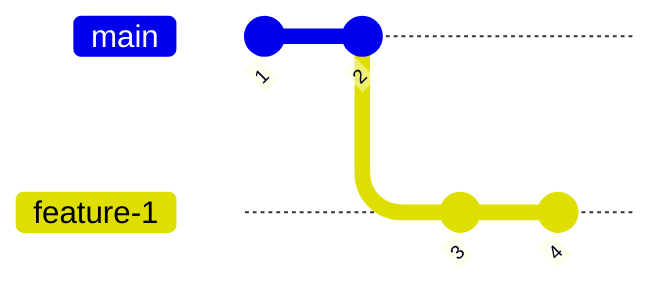

# Contexte

Suite de la discussion commencée en Point de partage dev.
L'idée étant ici d'arriver à une décision pour l'équipe STK.

Rappel de la question : quand pose-t-on une version stable (x.y.z) d'un composant ?
- à chaque merge ?
- une fois l'US validée ?
- quand on a décidé de mepper ? (peut embarquer plusieurs US)
- quand les poules auront des dents ?

Questions accessoires :  
- Quels impacts / comment adapter notre processus ? (quand indique-t-on la version dans le changelog, etc.)
- Comment versionner un hotfix si la prochaine version est déjà prise ?
# Déroulé

release candidate : pratique
Quand Stéphane valide => version stable

Cas d'exception : deux US dont le cycle de vie se superpose

Indiquer les bugs : pas forcément nécessaire de les faire apparaître dans le CHANGELOG

Par US
- dev sur une branche
	- mise à jour du CHG sur la branche
- merge sur master
- tag de release candidate
- validation par le PO
- tag stable
Dans la cadre de plusieurs US, la "seconde" se rebase sur la première : le changelog sera mis à jour naturellement. En cas de conflit : il faut repasser par le PO pour savoir quelle Us

Tagger une fois que toutes les US sont validées ?

C'est quoi un tag ?
=> version stable un tag stable a été validé parler PO

tag rc
=> version pas forcément stable

