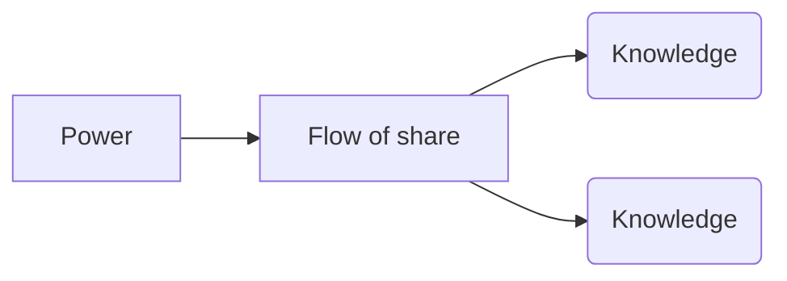

---
ressource:
  - 📺 Vidéo
author:
  - "[[Andrew Harmel-Law]]"
link:
  - https://vimeopro.com/newcrafts/newcrafts/video/949430725
trello: 
relates:
---
> Code is literally knowledge made manifest, and therefore offers a history of knowledge; it is a record of how people understood a problem over an extended period of time.
> 
> But code is also power, and the ability to write/approve/deploy it can be used for ill or good, (intentionally or unintentionally). In so doing, code solidifies power structures; embedding that which is inevitably unequally distributed (unintentionally or intentionally) but embedded all the same.
> 
> Code is therefore also a geology (genealogy?) of power structures. Code forms the landscape where records of our old ways of (dis)organising, and ideas that won, continue to shape everything because this code is where teams live now.
> 
> We experience this “code-as-knowledge-and-power” every day; our freedom to act restricted or permitted.
> 
> In this talk I’ll dissect what is at play here. I’ll consider what is happening with “code-as-knowledge-and-power” and show how to work with it intentionally, instead of suffering/benefitting disproportionately at the hands of it.
> 
> Your code, and your life, will be better as a result.
> ---
> Le code est littéralement une connaissance rendue manifeste et propose donc une histoire de la connaissance ; c'est un enregistrement de la façon dont les gens ont compris un problème sur une période de temps prolongée.
> 
> Mais le code est aussi un pouvoir, et la capacité de l'écrire/l'approuver/le déployer peut être utilisée pour le meilleur ou pour le meilleur (intentionnellement ou non). Ce faisant, le code solidifie les structures de pouvoir ; intégrer ce qui est inévitablement inégalement distribué (involontairement ou intentionnellement) mais néanmoins intégré.
> 
> Le code est donc aussi une géologie (généalogie ?) des structures de pouvoir. Le code forme le paysage dans lequel les enregistrements de nos anciennes méthodes de (dés)organisation et les idées qui ont gagné continuent de tout façonner, car ce code est l'endroit où vivent désormais les équipes.
> 
> Nous expérimentons chaque jour ce « code comme connaissance et pouvoir » ; notre liberté d’agir est restreinte ou autorisée.
> 
> Dans cet exposé, je vais décortiquer ce qui est en jeu ici. Je vais réfléchir à ce qui se passe avec le « code en tant que connaissance et pouvoir » et montrer comment travailler avec lui intentionnellement, au lieu d'en souffrir/bénéficier de manière disproportionnée.
> 
> Votre code et votre vie en seront meilleurs.

# Notes

**Structure Code is managing knowledge**

Knowledge <-- Flow of share --> Knowledge 
				^ Power

Structurelessness : informal structure appears smoke screen for hegemony
**Elite are a group of friends talking outside a meeting**

Code = Structured knowledge and power

*It's easier to imagine the end of the world than the end of capitalism*

3 ways to power

- **Control of Punishment**
  Could be formal / informal punishment (time to approve a pull request is informal punishment)
- **Control of Information**
  => You d'ont have to be a manager to have Power
- **Individual Charisma**
  People are afraid to change code because of whe wrote it

- **Freedom to Reorganize**
  Teams should be able to reorganize as wanted
- **Freedom to Move**
  Do not be trapped by Knowledge
- **Freedom to Disobey**
  => Anarchy != Chaos

# Ressources

- Conférence à retrouver et visionner : [[Knowledge : the energy of software design]]
- https://cacm.acm.org/research/the-role-of-knowledge-in-software-development/