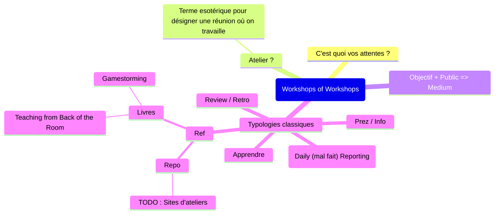

_Et si tout se jouait à la préparation ?_
- Le problème ne nous appartient pas
- Un facilitateur n'est pas un super héros. Une facilitatrice n'est pas une super héroïne.
- 5 Pratiques
	- Impliquer les parties prenantes avant / pendant / après l'atelier
	- Porteur du sujet présente visuellement la problématique
	- Détailler le dérouler
	- Prévoir de créer du liant
	- Partager son déroulé avec un autre facilitateur

_Cadrer, encadrer recadrer_
> _Il se passera ce qu'il doit se passer_

 - 7P pour préparer le cadre
	 - Purpose
	 - Public
	 - Process
	 - Product
	 - Pitfalls
	 - Prerequis
	 - Preparation
	 - (Past)
 - Cadrer 
	 - 4 Questions : Pour quoi ? / Qui ? / Quoi ? / Comment ?
	 - Règles
		 - Bienveillance
		 - **Respect**
		 - Ecoute
		 - Attention (==Implication==)
		 - Confiance
		 - Intention
	 - Sécurité : 
		 - Emotionnelle / Psychologique
		   => Je que j'amène / Ce que j'attends des autres
 - Cadres connus
	 - Réunion | Formation | Atelier de travail | Séminaire
	   => ==Prez / Info | Daily (mal fait) Reporting | Review / Retro | Apprendre==
	 - Cadres circulaires
		 - Sociocratie
		 - Holacratie
	 - Limites du cadre
		 - Interrompre
		 - Rappel des règles
		 - Protocoles de communication
		 - Pause
		 - Mediation
	 - Autocadres
		- [[World Coffee]]
		- [[Open Space Technology]]
		- Fishbowl
